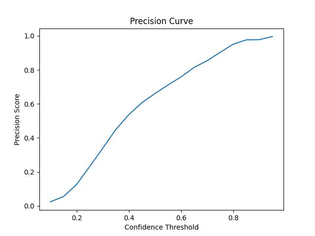

# tyre-parcel-detection

# Model Training (Yolo-nas):

# Steps :

	1.Data gathering
	
	2.Data Labeling With Autodistill
	
	3.Model Training (yolo-nas)
	
	4. Model Evaluation
	
	5.Run the infrence on video
	
	
1. Data gathering and labling is in dataset-generation folder.

2. Model training (yolo-nas)

	* run the command : python train.py
	
	Note: You might need to change the path of the dataset as per your need.
	
	* After training the model file will be stored in checkpoint directory.
	
3. Model Evaluation:

	* run the command : python evaluate.py
	
	Note: You might need to change the path of the dataset and model as per your need.

4. Run the infrence:

	* run the command : python infrence.py
	
	Note: you might need to change the path to the model and video.
	

	
## Evaluation Curves:

* Precision Score: 

